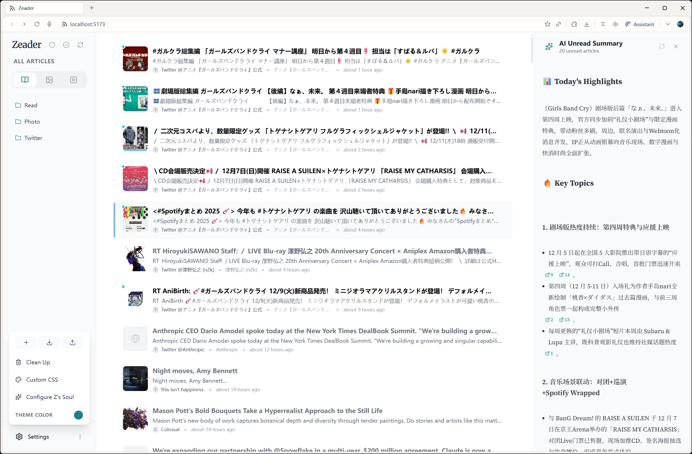
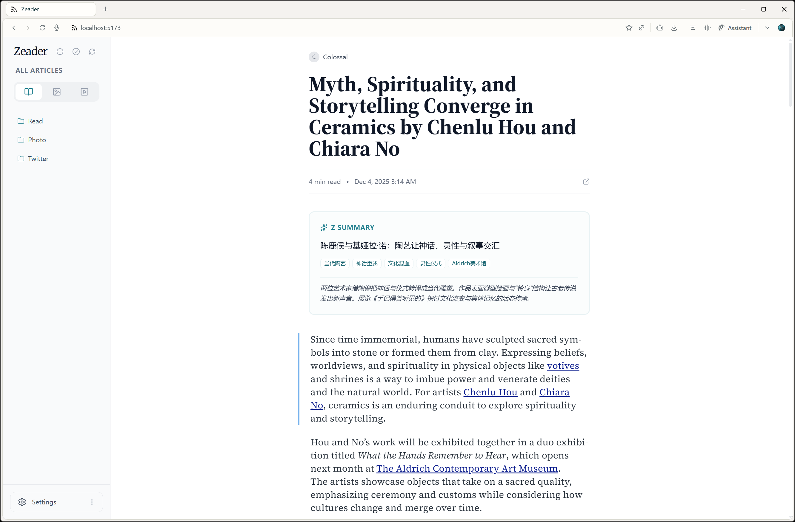
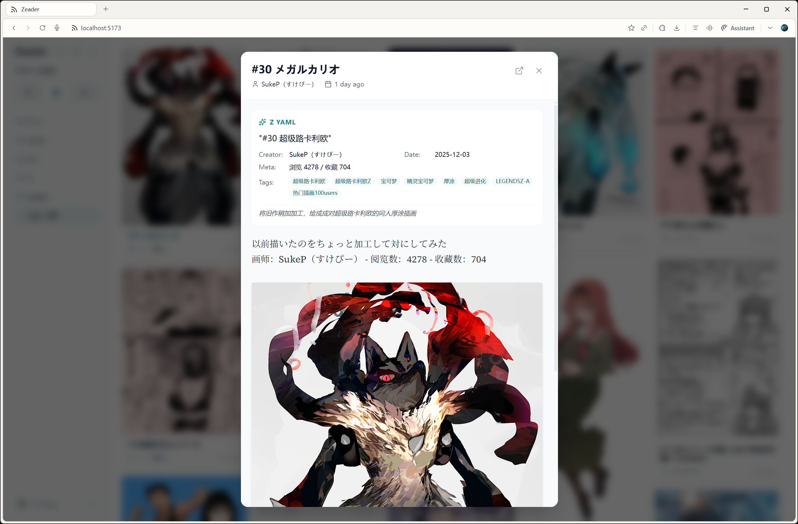
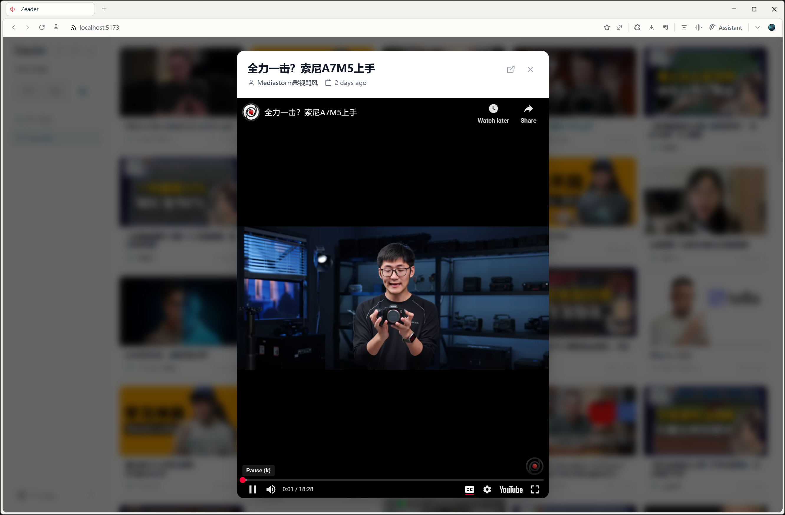

# Zeader RSS Reader

[English](./README.md) | 简体中文

一个基于 React 和 Node.js 构建的现代个人 RSS 阅读器，专为隐私、性能和卓越的用户体验而设计。

<table>
  <tr>
    <td></td>
    <td></td>
  </tr>
  <tr>
    <td></td>
    <td></td>
  </tr>
  <tr>
    <td></td>
    <td></td>
  </tr>
</table>

## 功能特性

- **跨平台支持**: 部署到服务器后，可在桌面端和移动端通过浏览器随时随地访问，完美适配各种屏幕尺寸。
- **智能订阅管理**: 轻松订阅 RSS/Atom 源，并通过自定义文件夹进行分类管理，保持阅读列表井井有条。
- **三视图模式**:
  - **文章视图**: 传统的列表布局，专为高效阅读文字内容而设计。
  - **图片视图**: 沉浸式的瀑布流网格布局，非常适合浏览图片为主的订阅源（如插画、摄影博客）。
  - **视频视图**: 专为视频内容设计的视图，支持 YouTube 等平台的内嵌播放。
- **隐私优先**: 所有数据均以 JSON 格式存储在您的本地机器上。没有外部服务器追踪您的阅读习惯——完全掌控您的数据。
- **OPML 支持**: 支持通过 OPML 导入功能，从其他 RSS 阅读器无缝迁移您的订阅列表。
- **交互式界面**:
  - **可折叠侧边栏**: 通过折叠侧边栏最大化您的阅读空间。
  - **拖拽排序**: 支持拖拽操作，直观地整理您的订阅源和文件夹。
  - **流畅动画**: 基于 Framer Motion 构建，提供丝滑的用户体验。
- **键盘导航**: 全键盘支持，让您无需鼠标即可浏览订阅源和文章。
- **AI 智能助手**: 内置 AI 集成，可即时生成文章摘要或解释选中的文本。
- **自定义 CSS**: 注入您自己的 CSS 样式，随心所欲地个性化 Zeader 的外观。

## AI 功能

- **Z YAML (瀑布流视图)**: 在画廊模态窗中自动生成结构化的 YAML 信息栏，提取标题、创作者和标签等关键信息。
- **Z Summary (文章视图)**: 打开文章时自动生成包含三句话的精简摘要和标签，助您快速掌握文章核心内容。
- **AI Unread Summary (未读摘要，快捷键: `Z` 或 `]`)**: 智能分析所有未读文章，生成一份综合新闻简报。它会识别文章间的共同主题、趋势和关联，呈现今日要点和独特见解。可点击的引用链接让您直接跳转到相关文章。

## 阅读功能

- **听文章 (Listen Article)**: 一键将文章文字转换为语音。通过内置音频播放器享受解放双手的阅读体验。
- **高亮与批注 (Highlight & Annotation)**:
  - **高亮**: 按 `h` 键高亮当前聚焦的段落块，或高亮您选中的文本。
  - **批注**: 按 `n` 键高亮并批注当前聚焦的段落块，或高亮并批注您选中的文本。
  - *注意*: Zeader 内的高亮和批注是**临时的**，一旦您离开当前页面，它们将**不会**被保留。如果需要保存，请使用 **Obsidian Clipper 集成**。

## Obsidian Clipper 集成

由于 Zeader 中的高亮和批注是临时的，我们强烈建议配合 [Obsidian Web Clipper](https://obsidian.md/clipper) 插件使用，将批注过的文章直接保存到您的 Obsidian 知识库中。

**配置指南:**

1.  项目根目录下提供了一个推荐的配置文件：`zeader-clipper.json`。
2.  将此配置文件导入到您的 Obsidian Web Clipper 插件设置中。
3.  **重要**: 请务必在 Clipper 设置的 "Triggers" (触发器) 列表中添加您的 Zeader 网址（例如 `http://localhost:5173/`），这样插件才能自动识别并触发保存功能。


## 键盘快捷键

掌握以下快捷键，像专业人士一样使用 Zeader：

### 全局
| 按键 | 动作                      |
| :--- | :------------------------ |
| `[`  | 切换侧边栏显示/隐藏       |
| `]`  | 切换 AI 未读摘要面板      |
| `1`  | 切换到文章视图 (所有文章) |
| `2`  | 切换到图片视图 (所有图片) |
| `3`  | 切换到视频视图 (所有视频) |

### 文章视图
| 按键      | 动作                         |
| :-------- | :--------------------------- |
| `h`       | 高亮选中文本/当前段落        |
| `n`       | 批注选中文本/当前段落        |
| `↑` / `↓` | 在文章列表中上下导航         |
| `Enter`   | 打开选中的文章               |
| `Space`   | 标记当前为已读并移动到下一篇 |
| `Z` / `]` | 切换 AI 未读摘要面板         |


### 图片 / 视频视图
| 按键                  | 动作             |
| :-------------------- | :--------------- |
| `↑` / `↓` / `←` / `→` | 在网格卡片中导航 |
| `Enter`               | 打开选中的项目   |

### 通用
| 按键  | 动作                     |
| :---- | :----------------------- |
| `Esc` | 关闭打开的模态框或详情页 |

## 移动端手势

Zeader 完全支持响应式设计，在移动设备上提供直观的触控操作：

- **底部导航栏**: 点击图标可在文章、图片和视频视图之间切换。
- **长按视图图标**: 弹出底部抽屉，显示该视图类型下的所有订阅源和文件夹。
- **设置入口**: 点击底部导航栏的齿轮图标，可访问设置功能，包括添加订阅、导入/导出 OPML、清理、自定义 CSS 和 AI 配置。
- **滑动手势**: 使用标准触控交互自然地浏览内容。

## 技术栈

- **前端**: React 19, Vite, Tailwind CSS v4, Zustand (状态管理), Framer Motion, Lucide React.
- **后端**: Node.js, Express.
- **数据存储**: 本地 JSON 文件.

## 本地开发

### 前置要求

- Node.js (推荐 v16 或更高版本)
- npm 或 yarn

### 安装步骤

1. 克隆仓库:
   ```bash
   git clone https://github.com/AsleepX/zeader-rss.git
   cd rss-reader
   ```

2. 安装依赖:
   ```bash
   npm install
   ```

### 运行应用

使用以下命令同时启动后端服务器和前端开发服务器：

```bash
npm run dev
```

- 前端访问地址: `http://localhost:5173`
- 后端 API 运行在: `http://localhost:5200`

## 部署

### 部署到服务器

要在服务器上部署 Zeader，请按照以下步骤操作：

1.  在服务器上**克隆仓库**：
    ```bash
    git clone https://github.com/AsleepX/zeader-rss.git
    cd rss-reader
    ```

2.  **安装依赖**：
    ```bash
    npm install
    ```

3.  **构建前端**：
    ```bash
    npm run build
    ```

4.  **启动服务器**：
    ```bash
    npm start
    ```
    服务器默认将在 5200 端口启动。您可以通过 `http://your-server-ip:5200` 访问应用。

    > **注意**：在生产环境中，后端服务器（端口 5200）会直接提供构建好的前端文件。这与开发模式不同（开发模式下 Vite 使用 5173 端口）。

    *可选*：您可以设置 `PORT` 和 `PASSWORD` 环境变量来自定义端口和启用密码保护。
    ```bash
    export PORT=8080
    export PASSWORD=your_secure_password
    npm start
    ```

### 部署到 Railway

您可以点击下方按钮一键部署 Zeader 到 Railway：

[](https://railway.com/deploy/pCRDAl?referralCode=0OR46e&utm_medium=integration&utm_source=template&utm_campaign=generic)

### 部署到 Zeabur

您可以点击下方按钮一键部署 Zeader 到 Zeabur：

[](https://zeabur.com/templates/4LNLFV)

## 项目结构

- `src/`: 前端 React 应用
- `server/`: 后端 Express 服务器和文件存储逻辑
- `data/`: 本地数据存储（订阅源和缓存文章）。

## License

MIT
